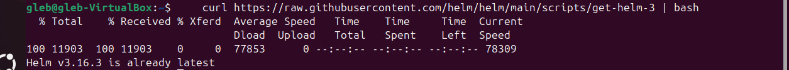
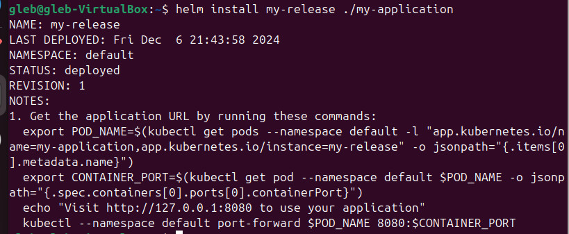
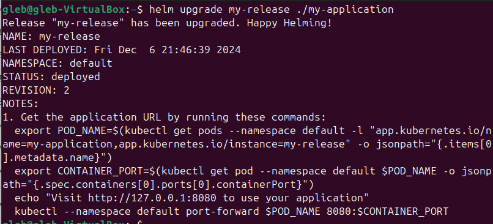

## Helm Chart

Шаг 1: **Создание Helm Chart**

Установите Helm, если он еще не установлен. Вы можете сделать это с помощью следующей команды:

```
    curl https://raw.githubusercontent.com/helm/helm/main/scripts/get-helm-3 | bash
```



Создайте новый Helm Chart:

```
    helm create my-application
```


Это создаст директорию my-application с предустановленными файлами и структурой.

Шаг 2: **Настройте Chart**:

Перейдите в созданную папку:

```
    cd my-application
```

Отредактируйте следующие файлы в соответствии с вашими требованиями:

- values.yaml: Укажите необходимые параметры, такие как имя образа и порты. Например:

```
    image:
      repository: my-docker-repo/my-app
      tag: latest
    service:
      type: ClusterIP
      port: 80
```

- templates/deployment.yaml: Убедитесь, что Deployment настроен правильно. Пример:

```
    apiVersion: apps/v1
    kind: Deployment
    metadata:
      name: {{ .Release.Name }}-deployment
    spec:
      replicas: 2
      selector:
        matchLabels:
          app: {{ .Release.Name }}
      template:
        metadata:
          labels:
            app: {{ .Release.Name }}
        spec:
          containers:
          - name: {{ .Release.Name }}
            image: "{{ .Values.image.repository }}:{{ .Values.image.tag }}"
            ports:
            - containerPort: 80
```

- templates/service.yaml: Настройте Service, если это необходимо. Пример:

```
    apiVersion: v1
    kind: Service
    metadata:
      name: {{ .Release.Name }}-service
    spec:
      type: {{ .Values.service.type }}
      ports:
      - port: {{ .Values.service.port }}
        targetPort: 80
      selector:
        app: {{ .Release.Name }}
```

Шаг 3: **Деплой в кластер**

Установите Chart в кластер:
Выполните команду для развертывания вашего Helm Chart:

```
    helm install my-release ./my-application
```



Здесь my-release — это имя вашего релиза.

Проверьте статус:
Убедитесь, что ваш релиз развернут успешно:

```
    helm list
    kubectl get all
```

Шаг 4: **Изменение сервиса и обновление релиза**

Измените параметры сервиса:
Например, измените порт в values.yaml:

```
    service:
      port: 8080
```

Обновите релиз:
Выполните команду для обновления релиза:

```
    helm upgrade my-release ./my-application
```


Проверьте обновление:
Убедитесь, что обновление прошло успешно:

```
    kubectl get services
```

Шаг 5: **Преимущества использования Helm**

Версионирование: Helm поддерживает управление версиями, что позволяет легко откатывать изменения к предыдущим версиям, если что-то пошло не так.

Упрощение управления зависимостями: Helm позволяет легко управлять зависимостями между различными компонентами и сервисами, что упрощает установку и обновление приложений.

Шаблонизация: С помощью Helm можно использовать шаблоны для создания конфигураций, что позволяет избежать дублирования кода и упрощает управление конфигурациями для разных окружений (например, dev, staging, production).
